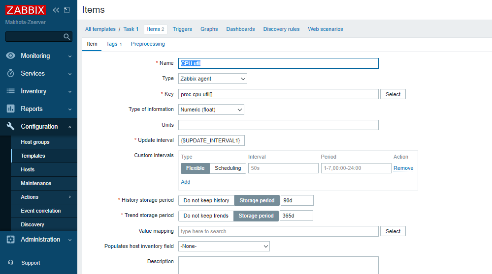

# Домашнее задание к занятию "9.3. Система мониторинга Zabbix. Часть 2" - `Елена Махота`

- [Ответ к Заданию 1](#1)
- [Ответ к Заданию 2-3](#2-3)
- [Ответ к Заданию 4](#4)
- [Ответ к Заданию 8*](#8)
- [Ответ к Заданию 9*](#9)
 

 ---

### Задание 1

Создайте свой шаблон, в котором будут элементы данных, мониторящие загрузку CPU и RAM хоста.

*Сохраните в Git скриншот страницы шаблона с названием “Задание 1”*

### *<a name="1">Ответ к Заданию 1</a>*

 ---

### Задание 2

Добавьте в Zabbix два хоста и задайте им имена <фамилия и инициалы-1> и <фамилия и инициалы-2>. Пример: ivanovii-1 и ivanovii-2

*Результат данного задания сдавайте вместе с Заданием 3*

 ---

### Задание 3

Привяжите созданный вами шаблон к двум хостам. Так же привяжите к обоим хостам шаблон Linux by Zabbix Agent.

*Сохраните в Git скриншот страницы хостов где будут видны привязки шаблонов с названием “Задание 2-3”. Хосты должны иметь зелёный статус подключения*

### *<a name="2-3">Ответ к Заданию 2-3</a>*

 ---

### Задание 4

Создайте свой кастомный дашборд

*Сохраните в Git скриншот дашборда с названием “Задание 4”*

### *<a name="4">Ответ к Заданию 4</a>*

 ---

### Задание 8* (со звездочкой, дополнительное)

Настройте автообнаружение и прикрепление к хостам созданного вами ранее шаблона.

*Приложите в Git скриншот правила обнаружения. Приложите в Git скриншот страницы Discover где видны оба хоста.*

### *<a name="8">Ответ к Заданию 8</a>*

 ---

### Задание 9*** (со звездочкой, дополнительное)

Доработайте скрипты Vagrant для выкатки 2х агентов, чтобы они были готовы к автообнаружению сервером, а так же имели на борту разработанные вами ранее юзерпараметры. Ссылка на скрипты

*Приложите в Git файлы Vagrantfile и zabbix-agent.sh*

### *<a name="9">Ответ к Заданию 9</a>*

Вместо vagrant использовала терраформ, приложила файлы

[/terraform](terraform)

**Результат**

